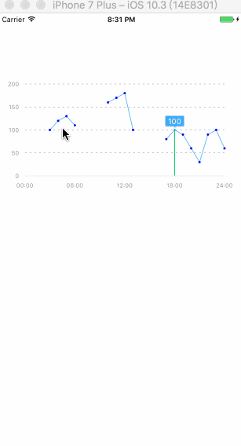

# MGChartLineView
### 分段绘制折线指示图

<p align="center">


</p>


**核心思想**

> 遍历所有的值, 将不需要的(0 或者 空字符串"")找出, 只要 *前一个* 出现空值, 就添加`moveToPoint` 方法 然后 `addLineToPoint` 连线.


```

/// 记录上一个值
if (i >= 1)  lastValue = [self.valueArray[i - 1] floatValue];

```

## 主要分为2部分

* 绘制底层折线坐标轴 (MGAxisView 类)
* 绘制折线,连接点 (MGChartLineView 类)

## 这里主要讲解  MGChartLineView 类的内容,主要分为3个部分

#### 第一部分 绘制折线
```

/**
 * 绘制折线路径
 */
- (void)drawChartLine
{
    UIBezierPath *pointAxisPath = [[UIBezierPath alloc] init];
    
    CGFloat lastValue = 0;
    
    CGFloat nextValue = 0;
    
    for (int i = 0; i < self.valueArray.count; i ++) {
        
        CGFloat point_X = self.xScaleMarkLEN * i + self.startPoint.x;
        
        if (i >= 1)  lastValue = [self.valueArray[i - 1] floatValue];
        
        CGFloat value = [self.valueArray[i] floatValue];
        
        if (i <= _valueArray.count - 2) nextValue =  [self.valueArray[i + 1] floatValue];

        CGFloat percent = value / self.maxValue;
        
        CGFloat point_Y = self.yAxis_L * (1 - percent) + self.startPoint.y;
        
        CGPoint point = CGPointMake(point_X, point_Y);
        
        if (value > 0) [pointArray addObject:[NSValue valueWithCGPoint:point]];
        
        if (value > 0 && lastValue == 0)
        {
            [pointAxisPath moveToPoint:point];
        }
        
        if (value != 0 )
        {
            [pointAxisPath addLineToPoint:point];
        }
        
    }
    
}


```


#### 第二部分 绘制折线
```
- (void)setupCircleViews
{
    for (int i = 0; i < pointArray.count; i ++)
    {
        
        // 添加小圆点
        CGPoint center = [pointArray[i] CGPointValue];
        
        CGFloat radius = 2.0f;
        
        UIView *circleView = [[UIView alloc] initWithFrame:CGRectMake(center.x - radius,
                                                                      center.y - radius,
                                                                      radius * 2.0,
                                                                      radius * 2.0)];
        circleView.tag = i + BASE_TAG_CIRCLEVIEW;
        
        circleView.backgroundColor = [UIColor blueColor];
        
        circleView.layer.cornerRadius = 2;
        
        circleView.layer.masksToBounds = YES;
        
        
        [self addSubview:circleView];
        
        // 竖直指示线
        UIView *markLine = [[UIView alloc] initWithFrame:CGRectMake(center.x - 0.5,
                                                                    center.y - 0.5,
                                                                    1,
                                                                    (1-center.y / self.yAxis_L) * self.yAxis_L + self.startPoint.y)];
        
        markLine.tag = i + BASE_TAG_CIRCLEVIEW*2 ;
        
        [self addSubview:markLine];
        
    }
}

```
#### 第三部分 绘制折线
```


// 添加覆盖
- (void)setupCoverViews
{
    
    for (int i = 0; i < pointArray.count; i ++)
    {
        
        UIView *coverView = [[UIView alloc] init];
        
        coverView.tag = BASE_TAG_COVERVIEW + i;
        
        CGPoint point = [pointArray[i] CGPointValue];
        
        coverView.frame = CGRectMake(point.x - self.xScaleMarkLEN / 2,
                                     self.startPoint.y,
                                     self.xScaleMarkLEN,
                                     self.yAxis_L);
        
        
        
        [self addSubview:coverView];
        
        // 添加点击手势
        UITapGestureRecognizer *gesutre = [[UITapGestureRecognizer alloc] initWithTarget:self
                                                                                  action:@selector(gesutreAction:)];
        [coverView addGestureRecognizer:gesutre];
    }
    
}

```

###github地址: [戳这里](https://github.com/Maling1255/MGChartLineView)

